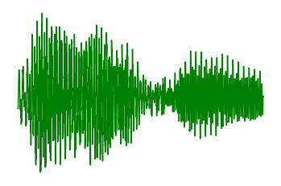

## A Step-By-Step Tutorial on Speech Processing, Analysis, and Classification 

- ## This tutorial is divided into 2 parts:

    - Part 1: Demonstrates how to convert signal to frequency domain, compute spectrogram, mel-spectrogram, and MFCC step by step.
    - Part 2: Introduction to MultiResolution Analysis and Wavelet Transform. Classification using Wavelet Transform

<hr>

- ## Steps to use this repository:

    - Create a virtual environment by using the command: ```virtualenv venv```
    - Activate the environment: ```source venv/bin/activate```
    - Install the requirements.txt file by typing: ```pip install -r requirements.txt```
    - Extract the recordings.zip file
    - Run the Jupyter Notebook

- ## Files Description

    - recordings.zip: The contains recordings from the Free Spoken Digit Dataset (FSDD). You can also find this data [here](https://github.com/Jakobovski/free-spoken-digit-dataset). 
    - training_raw_audio.npz: We are only classifying 3 speakers here: george, jackson, and lucas. All the training data from these 3 speakers is in this numpy zip file.
    - testing_raw_audio.npz: We are only classifying 3 speakers here: george, jackson, and lucas. All the testing data from these 3 speakers is in this numpy zip file.
    - training_features.npz: It contains all the wavelet transform features of the training data audio files.
    - testing_features.npz: It contains all the wavelet transform features of the testing data audio files.
    - requirements.txt: It contains the required libraries.